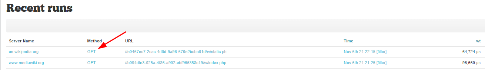

[](https://github.com/ddev/ddev-addon-template/actions/workflows/tests.yml) 

# ddev-xhgui <!-- omit in toc -->

- [Introduction](#introduction)
- [Warning](#warning)
- [Getting started](#getting-started)
- [Framework configuration](#framework-configuration)
  - [Drupal](#drupal)
  - [WordPress](#wordpress)
  - [Silverstripe](#silverstripe)
- [Usage](#usage)
- [Configuration](#configuration)

## Introduction

This addon adds the XHGui service to a project served by DDEV.

[XhGui](https://github.com/perftools/xhgui) is a graphical interface for XHProf profiling data that can store the results in MongoDB or PDO database.

See <https://performance.wikimedia.org/xhgui/> for an demonstration of XHGui data collection.

## Warning

This addon is for debugging in a development environment.
Profiling in a production environment is not recommended.

## Getting started

- Install the `ddev-xhgui` add-on:

  ```shell
  ddev get tyler36/ddev-xhgui
  ddev restart
  ```

## Framework configuration

### Drupal

- Install `perftools/php-profiler`

   ```shell
   ddev composer require perftools/php-profiler --dev
   ```

- Add the following line to `web/sites/default/settings.php` to include the collector.

   ```php
   if (file_exists("/mnt/ddev_config/xhgui/collector/xhgui.collector.php")) {
    require_once "/mnt/ddev_config/xhgui/collector/xhgui.collector.php";
   }
   ```

### WordPress

- Install `perftools/php-profiler`
  - If using [bedrock](https://roots.io/bedrock/)

   ```shell
   ddev composer require perftools/php-profiler --dev
   ```

  - If using vanilla WordPress:

   ```shell
   wget https://github.com/perftools/php-profiler/archive/refs/tags/0.18.0.tar.gz
   tar -xvf 0.18.0.tar.gz
   ```

- Add the following line to `wp-config-ddev.php` to include the collector.

   ```php
   require_once __DIR__ . '/php-profiler-0.18.0/autoload.php';
   if (file_exists("/mnt/ddev_config/xhgui/collector/xhgui.collector.php")) {
     require_once "/mnt/ddev_config/xhgui/collector/xhgui.collector.php";
   }
   ```

- Remove `#ddev-generated` from `wp-config-ddev.php` to prevent DDEV overriding it.

### Silverstripe

- Install `perftools/php-profiler`

   ```shell
   ddev composer require perftools/php-profiler --dev
   ```

- Add the following line to `public/index.php`, right after the autoload includes, to include the collector.

  ```php
  if (file_exists(__DIR__ . '/../vendor/autoload.php')) {
    require __DIR__ . '/../vendor/autoload.php';
  } elseif (file_exists(__DIR__ . '/vendor/autoload.php')) {
      require __DIR__ . '/vendor/autoload.php';
  } else {
      header('HTTP/1.1 500 Internal Server Error');
      echo "autoload.php not found";
      exit(1);
  }
  if (file_exists("/mnt/ddev_config/xhgui/collector/xhgui.collector.php")) {
   require_once "/mnt/ddev_config/xhgui/collector/xhgui.collector.php";
  }
  ```

## Usage
Run the following commands to enable profiling and then launch the XHGui in your browser.

```shell
ddev xhprof on && ddev xhgui
```

By default, XHGui will be available at `https://yourproject.ddev.site:8143`.

For detailed information about a single request, click on the "Method" keyword on the "Recent runs" dashboard.



Remember, if you updated `settings.ddev.php` or `wp-config-ddev.php`, these file will be overwritten unless you remove the `#ddev-generated`.

Use the following command to check the logs:

   ```shell
   ddev logs -s xhgui
   ```

## Configuration

To configure XhGui, update `.ddev/xhgui/xhgui.config.php`.

For example, to set XHGui to use `Asia/Toyko` timezone for dates:

- Remove `#ddev-generated` from `.ddev/xhgui/xhgui.config.php`
- Change the timezone value

  ```php
    'timezone' => 'Asia/Tokyo',
    'date.format' => 'Y-m-d H:i:s',
  ```

**Contributed and maintained by [@tyler36](https://github.com/tyler36) based on the original [ddev-contrib PR](https://github.com/ddev/ddev-contrib/pull/128) by [@penyaskito](https://github.com/penyaskito)**
